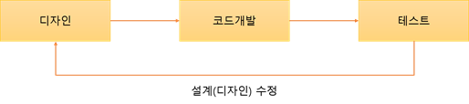

# TDD

## 환경 설정

### npm

- Test module install

> node @testing-library/jest-dom @types/jest

- jsconfig.json - 루트 디렉토리 설정 1

```json
{
  "compilerOptions": {
    "baseUrl": "src",
    "rootDir": ".",
    "paths": {
      "~/*": ["*"]
    }
  }
}
```

- .env - 루트 디렉토리 설정 2

```env
NODE_PATH=src/
```

- jest cache clear

> package.json

```json
...
"scripts": {
    ...
    "clear_jest": "jest --clearCache"
}
...
```

> npm script

npm cache clean --force

## Test Setup

> setupTests.js - src 하위폴더

```js
import "@testing-library/jest-dom/extend-expect"
```

---
---

# TDD ( 테스트 주도 개발 )

## 테스트 주도 개발(TDD)이란?
테스트 주도 개발(TDD)은 설계 이후 코드 개발 및 테스트케이스를 작성하는 기존의 개발 프로세스(그림1)와 다르게 테스트케이스를 작성 한 후 실제 코드를 개발하여 리펙토링하는 절차(그림2)를 따른다. 이러한 이유로 TDD를 Test First Development라고도 한다.
1. 기존의 프로세스  

1. TDD 프로세스  


+ TDD 장점
    -  작업과 동시에 테스트를 진행함으로써 실시간으로 오류 상황을 파악하여 시스템 결함을 방지
    -  짧은 개발 주기를 통해 고객의 요구사항을 빠르게 수용하거나 피드백을 줄 수 있고 현재 진행 상황을 쉽게 파악
    - 자동화 도구를 이용해 TDD의 테스트케이스를 단위테스트로 사용이 가능
   테스트 자동화 도구는 Junit(Java), CppUnit(C/C++), NUnit(.NET) 등이 있음
 
+ TDD 단점
    - 기존의 개발프로세스에 테스트케이스 설계까지 추가되므로 코드 생산 비용이 높아짐
    - 어떻게 테스트를 할 것이며, 프로젝트 성격에 따른 테스트 프레임워크 선택 등 여러 부분에 대한 고려가 필요

## TDD의 3가지 절차
1. 실패   
이는, 실패하는 테스트 케이스를 먼저 만들라는 것 입니다. 실패하는 테스트 케이스를 만들 때는 프로젝트의 전체 기능에 대하여 처음부터 모든 테스트 케이스를 작성하는 것이 아니라, 지금 가장 먼저 구현할 기능 하나씩 테스트 케이스를 작성합니다.

1. 성공  
우리가 작성하는 실패하는 테스트 케이스를 통과시키기 위하여, 코드를 작성하여 테스트를 통과시키는 것 입니다.

1. 리팩토링  
우리가 구현한 코드에 중복되는 코드가 있거나, 혹은 더 개선시킬 방법이 있다면 리팩토링을 진행합니다. 리팩토링을 진행하고 나서도 테스트 케이스가 성공하는지 확인합니다. 이 절차가 끝났다면, 다시 첫번째 절차로 돌아가서 다음 기능 구현을 위하여 새로운 실패하는 테스트 케이스를 작성하세요.

### TodoApp.test.js  
```JavaScript
import React from 'react';
import TodoApp from './TodoApp';
import { render, fireEvent } from 'react-testing-library';

describe('<TodoApp />', () => {
  // 등록의 Text와 TodoList의 Id의 존재유무
  it('renders TodoForm and TodoList', () => {
    const { getByText, getByTestId } = render(<TodoApp />);
    getByText('등록'); // TodoForm 존재유무 확인
    getByTestId('TodoList'); // TodoList 존재유무 확인
  });
  // default의 값
  it('renders two defaults todos', () => {
    const { getByText } = render(<TodoApp />);
    getByText('TDD 배우기');
    getByText('react-testing-library 배우기');
  });
  // Event의 trigger : fireEvent
  it('creates new todo', () => {
    const { getByPlaceholderText, getByText } = render(<TodoApp />);
    // 이벤트를 발생시켜서 새 항목을 추가하면
    fireEvent.change(getByPlaceholderText('할 일을 입력하세요'), {  // change 이벤트를 발생
      target: {
        value: '새 항목 추가하기'  // 텍스트창에 '새 항목 추가하기'을 넣는다
      }
    });
    fireEvent.click(getByText('등록'));  // 클릭 이벤트를 발생시킨다
    // 해당 항목이 보여져야합니다.
    getByText('새 항목 추가하기');  // 이벤트가 실행 후 '새 항목 추가하기'가 있는지 검사
  });

  it('toggles todo', () => {
    const { getByText } = render(<TodoApp />);
    // TDD 배우기 항목에 클릭 이벤트를 발생시키고 text-decoration 속성이 설정되는지 확인
    const todoText = getByText('TDD 배우기');
    expect(todoText).toHaveStyle('text-decoration: line-through;');
    fireEvent.click(todoText);
    expect(todoText).not.toHaveStyle('text-decoration: line-through;');
    fireEvent.click(todoText);
    expect(todoText).toHaveStyle('text-decoration: line-through;');
  });

  it('removes todo', () => {
    const { getByText } = render(<TodoApp />);
    const todoText = getByText('TDD 배우기');
    const removeButton = todoText.nextSibling;
    fireEvent.click(removeButton);
    expect(todoText).not.toBeInTheDocument(); // 페이지에서 사라졌음을 의미함
    /*
      또 다른 방법:
      const removedText = queryByText('TDD 배우기');
      expect(removedText).toBeFalsy(); 
    */
  });

});
```